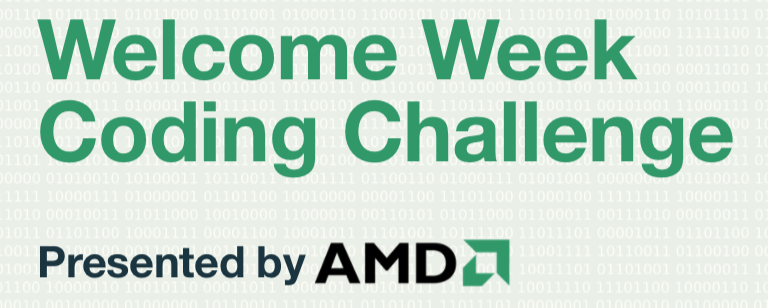

# McMaster Engineering Welcome Week Coding Challenge 2018

## Introduction

Welcome to the Welcome Week Coding Challenge, presented by AMD! We're happy to welcome both complete beginners who have never coded, and more experienced programmers. If you've never programmed before and want to get learning, proceed to Tier 1! If you've never programmed before and think you're up for a challenge, proceed to Tier 2!

## Tier 1 (Beginner)
Folow the steps below: 
* View the questions for beginners [here](tier1questions.pdf)
* Open up a Python Editor (IDLE) with the help of a mentor!
* Try creating a file and saving it.
* Begin working on the solutions. 
* Create a separate .py file for every question
* ZIP all your files
* Submit your ZIP folder [here](https://driveuploader.com/upload/4MwYgEj5xf/)

## Tier 2 (Intermediate)
Folow the steps below: 
* View the questions for Tier 2 [here](tier2questions.pdf)
* Open up a Python Editor (IDLE)
* Begin working on the solutions. 
* Create a separate .py file for every question
* ZIP all your files
* Submit your ZIP folder [here](https://driveuploader.com/upload/EnDi8QAEH7/)

## Prizes 
Prizes will be awarded separately to each category!
* 1st place: AMD usb speaker + t-shirt
* 2nd place: AMD mug + t-shirt
* 3rd place: AMD pen + notebook 

### Acknowledgements
Special thanks to AMD and the University Relations Team for helping us out with the event! 

